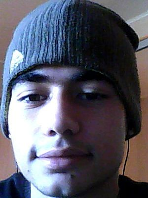

# Aek Vartanyan



## My Contacts:

**My Discord:** _Aek Vartanian (@aichik)_
**My email:** _aichik.person@gmail.com_

## About Me:

**I'm a Web Developer.** I have excellent and different knowledge in _front-end development_. I work on building semantic HTML and CSS code which is according to W3C standards. I consider myself a person who follows the best and modern web development practices. **_I always do my best!_**

## My Skills:

- ✅ **HTML, HTML5**
- ✅ **CSS, CSS3, SCSS**
- ✅ **HTML Email, HTML Template**
- ✅ **Clean HTML Semantic Markup**
- ✅ **Cross-Browser Compatibility (Chrome, Firefox, Safari)**
- ✅ **Coding to W3C Web Standards**
- ✅ **Responsive Web Design, Mobile-First Development, Pixel Perfect Development**
- ✅ **Version Control System (GIT)**
- ✅ **BEM**
- ✅ **JavaScript**
- ✅ **Mailchimp**

## My Code on Codewars:

```
function multiply(a, b){
return a * b
}
```

## My Project:

**"CV#1. Markdown & Git".** You can get it [On This Link](https://aichik.github.io/rsschool-cv/cv "Markdown & Git")

## Education:

**Incomplete Higher Education.** Took courses markup on freecodecamp.

## English Level:

**Intermediate.** Took many different courses already. Udemy, Basic English and other.
